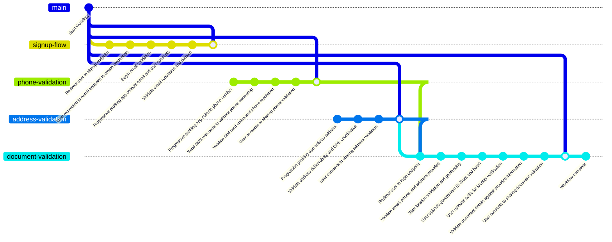

```mermaid
---
config:
  theme: mc
---
gitGraph
   commit id:"Start Workflow"
   branch signup-flow
   commit id:"Redirect user to signup endpoint"
   commit id:"User redirected to Auth0 endpoint to create credentials"
   commit id:"Begin email validation"
   commit id:"Progressive profiling app collects email and user consents"
   commit id:"Validate email reputation and domain"
   merge main
   branch phone-validation
   commit id:"Redirect user to login endpoint"
   commit id:"Progressive profiling app collects phone number"
   commit id:"Send SMS with code to validate phone ownership"
   commit id:"Validate SIM card status and phone reputation"
   commit id:"User consents to sharing phone validation"
   merge main
   branch address-validation
   commit id:"Redirect user to login endpoint"
   commit id:"Progressive profiling app collects address"
   commit id:"Validate address deliverability and GPS coordinates"
   commit id:"User consents to sharing address validation"
   merge main
   branch document-validation
   commit id:"Redirect user to login endpoint"
   commit id:"Validate email, phone, and address provided"
   commit id:"Start location validation and geofencing"
   commit id:"User uploads government ID (front and back)"
   commit id:"User uploads selfie for identity verification"
   commit id:"Validate document details against provided information"
   commit id:"User consents to sharing document validation"
   merge main
   commit id:"Workflow complete"
```
